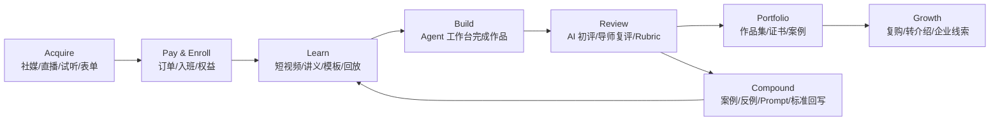
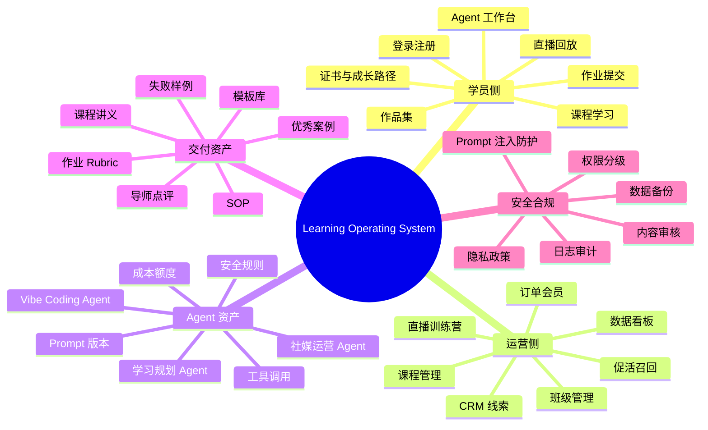
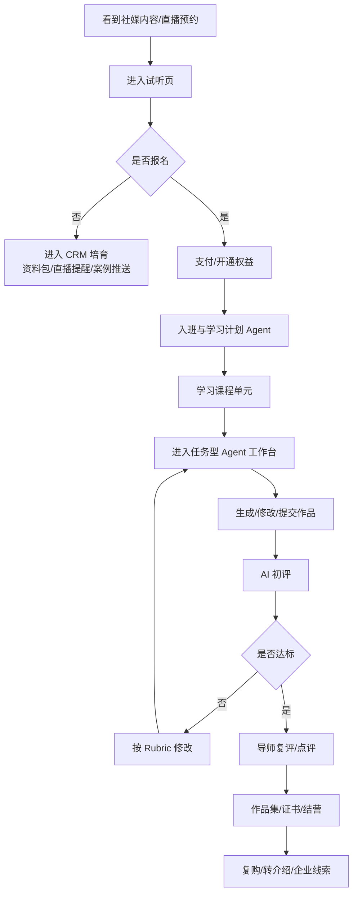
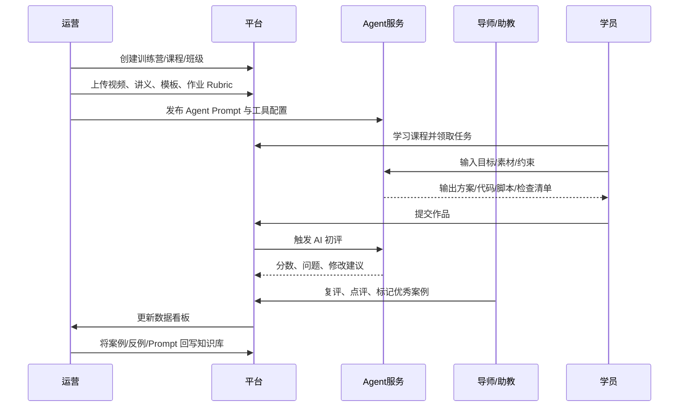
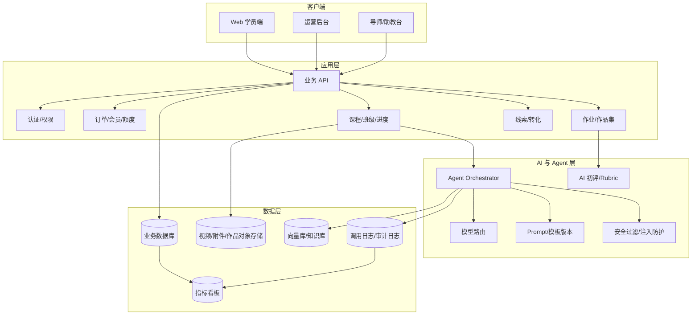
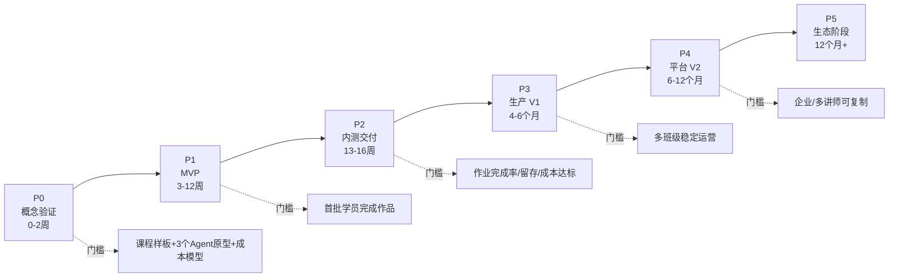
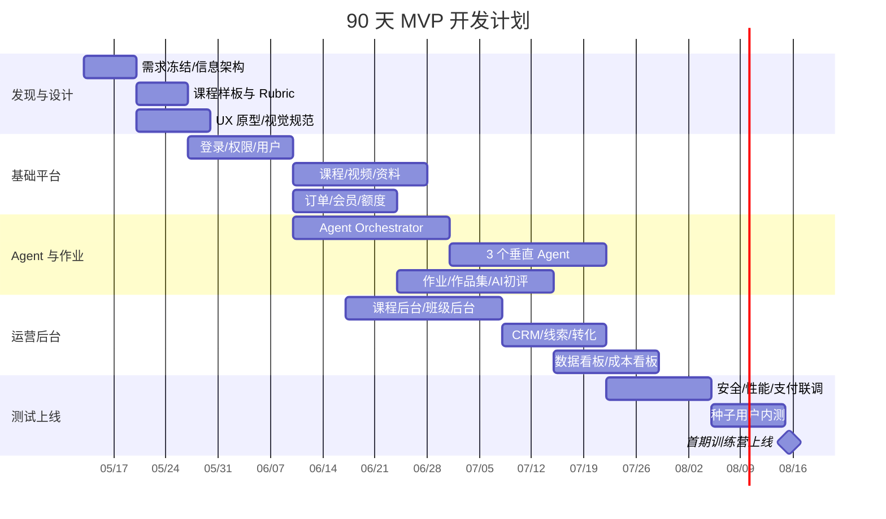
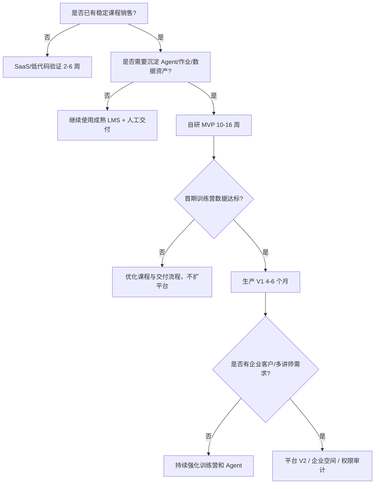

# Learning Operating System 教学交付平台开发周期与成本研究报告

> 版本：v1.0  
> 日期：2026-05-12  
> 对象：AI 原生线上培训交付平台，参考 `learning-operation-system/index.html` 的平台规划。  
> 核心结论：先用 90 天跑通训练营交付闭环，再把 Agent、作业、作品集、CRM 与数据资产产品化。不要先做“大而全网校”，也不要优先自研直播推流、大模型、复杂 IM 或开放 Agent 市场。

---

## 1. 执行摘要

### 1.1 结论总览

| 方案 | 适用场景 | 周期 | 一次性开发成本 | 月度运营成本 | 主要风险 |
|---|---:|---:|---:|---:|---|
| A. SaaS 拼装验证 | 先卖课、验证需求、1-2 个训练营 | 2-6 周 | 5-20 万元 | 0.5-3 万元/月 | 数据分散、体验割裂、后续迁移成本 |
| B. 轻量自研 MVP | 90 天上线闭环：课程、作业、3 个 Agent、基础后台 | 10-14 周 | 35-80 万元 | 1-6 万元/月 | 代码质量、权限/支付/风控不足 |
| C. 标准生产 V1 | 训练营可稳定运营，支持班级、助教、AI 初评、CRM | 4-6 个月 | 120-300 万元 | 3-15 万元/月 | 需求膨胀、Agent 成本、数据治理 |
| D. 平台化 V2 | 多课程、多讲师、企业空间、Agent 版本管理 | 6-12 个月 | 350-900 万元 | 10-60 万元/月 | 组织复杂度、合规、SLA、成本失控 |
| E. 生态/市场 | Agent 市场、讲师入驻、企业私有 Agent 定制 | 12-18 个月+ | 900-2000 万元+ | 50 万元/月+ | 平台治理、交易纠纷、安全审核 |

### 1.2 推荐路线

**推荐采用 B → C → D 的混合路线：**

1. 第 0-2 周：需求冻结、课程样板、Agent 原型、数据指标定义。
2. 第 3-12 周：自研 MVP，聚焦“课程学习 + 作业作品集 + 3 个 Agent + 轻 CRM + 数据看板”。
3. 第 13-16 周：小班内测、成本压测、安全加固、导师/助教 SOP。
4. 第 4-6 个月：生产 V1，补齐班级管理、AI 初评、会员额度、订单、运营后台。
5. 第 6-12 个月：平台 V2，做企业空间、Agent 版本管理、团队看板、安全审核。

### 1.3 核心成本判断

开发成本不是最大不确定性，**真正容易失控的是三类运行成本**：

| 成本项 | 为什么会失控 | 控制原则 |
|---|---|---|
| Agent/API 调用 | 学员频繁对话、作业批改、长上下文、图片/语音生成 | 额度、缓存、分层模型、异步批处理、先模板后自由问答 |
| 视频交付 | 课程回放、直播回放、重复观看、下载、高清码率 | 使用成熟视频云，避免自研转码/CDN；按分钟或带宽建模 |
| 人工辅导 | 助教答疑、作业复评、社群运营、投诉处理 | AI 初评 + Rubric + 队列分派，导师只处理高价值节点 |

---

## 2. 平台定义与边界

### 2.1 不是“视频网校”，而是“交付操作系统”

从现有规划可提炼出一句产品定义：

> 把“听课”变成“完成任务”，把“使用 AI”变成“交付作品”，并让每一期训练营的案例、提示词、评分标准和学员行为数据回写为下一期的系统资产。

### 2.2 核心闭环



### 2.3 平台范围思维导图



### 2.4 MVP 必须做与必须不做

| 类型 | 必须做 | 暂不做 |
|---|---|---|
| 课程 | 课程目录、视频播放、讲义、模板、进度 | 复杂学习路径推荐、多人协同白板 |
| 直播 | 直播预约、回放挂载、直播资料归档 | 自研推流、自研低延迟直播协议 |
| Agent | 3 个垂直 Agent、提示词版本、调用日志、额度 | 通用 Agent 市场、开放插件生态 |
| 作业 | 作业提交、AI 初评、导师复评、Rubric、修改记录 | 全自动判分、复杂反作弊系统 |
| CRM | 线索、渠道、试听、报名、班级转化 | 完整营销自动化平台 |
| 数据 | 激活、留存、作业、作品、复购、API 成本 | 大规模 BI 数仓、复杂归因模型 |
| 安全 | 权限、日志、内容审核、隐私政策 | 企业级 DLP、私有化多租户隔离 |

---

## 3. 用户流程、业务流程与系统流程

### 3.1 学员主流程



### 3.2 课程交付流程



### 3.3 系统架构建议



---

## 4. 开发演进路线图

### 4.1 阶段门控



### 4.2 详细阶段拆解

| 阶段 | 周期 | 目标 | 交付物 | 验收指标 |
|---|---:|---|---|---|
| P0 概念验证 | 0-2 周 | 证明“课程 + Agent + 作业”闭环成立 | 原型、课程样板、Agent Prompt、Rubric、成本表 | 5-10 名种子用户完成一次任务 |
| P1 MVP | 3-12 周 | 90 天上线可收费训练营 | 学员端、课程、作业、3 Agent、后台、订单、日志 | 首批 50-200 人可完成学习和提交 |
| P2 内测交付 | 13-16 周 | 修流程、控成本、补安全 | 内测报告、性能压测、SOP、隐私/协议 | 7 日留存、作业提交率、AI 单人成本达标 |
| P3 生产 V1 | 4-6 个月 | 支持多班级运营 | 班级、助教台、AI 初评、CRM、会员额度、数据看板 | 3-5 个训练营并行 |
| P4 平台 V2 | 6-12 个月 | 支持多课程与企业客户 | 企业空间、团队、Agent 版本、审计、安全审核 | 企业客户交付、SLA、权限隔离 |
| P5 生态阶段 | 12 个月+ | 讲师/Agent/课程生态 | 讲师入驻、Agent 市场、收益分成、风控 | 供给增长、交易 GMV、投诉率可控 |

### 4.3 90 天 MVP 甘特图



---

## 5. 工作分解结构 WBS

### 5.1 MVP 功能 WBS

| 编号 | 模块 | 子任务 | 复杂度 | MVP 是否必需 | 主要角色 |
|---|---|---|---:|---|---|
| 1 | 用户与权限 | 登录、注册、手机号/邮箱、角色、班级权限 | 中 | 是 | 后端、前端 |
| 2 | 课程学习 | 课程目录、课时、进度、讲义、模板下载 | 中 | 是 | 前端、后端 |
| 3 | 视频交付 | 上传、播放、回放、试看、权限播放 | 中 | 是 | 后端、前端、DevOps |
| 4 | 直播训练营 | 直播预约、回放绑定、资料归档 | 中 | 是 | 后端、运营 |
| 5 | 作业系统 | 作业发布、提交、附件、版本、修改记录 | 中 | 是 | 前端、后端 |
| 6 | AI 初评 | Rubric、自动评分、修改建议、重评队列 | 高 | 是 | AI 工程、后端 |
| 7 | Agent 工作台 | 输入字段、模板、对话、生成、保存、日志 | 高 | 是 | AI 工程、前端、后端 |
| 8 | Prompt 管理 | Prompt 版本、灰度、回滚、效果记录 | 中 | 是 | AI 工程、产品 |
| 9 | CRM | 线索、渠道、试听、转化、跟进记录 | 中 | 是 | 后端、前端 |
| 10 | 订单会员 | 订单、权益、发票字段、退款记录、额度 | 中 | 是 | 后端 |
| 11 | 作品集 | 学员作品、公开/私密、案例标记、证书 | 中 | 是 | 前端、后端 |
| 12 | 数据看板 | 激活、留存、作业、Agent 成本、转化 | 中 | 是 | 后端、数据 |
| 13 | 内容审核 | 敏感词、人工审核、违规记录 | 中 | 建议 | 后端、运营 |
| 14 | 安全审计 | 日志、权限审计、备份、告警 | 中 | 是 | DevOps、后端 |
| 15 | 企业空间 | 组织、团队、成员、空间隔离 | 高 | 否 | 后端、前端 |
| 16 | Agent 市场 | 上架、分成、评价、审核、结算 | 高 | 否 | 全栈、风控 |

### 5.2 人员配置

| 阶段 | 最小团队 | 标准团队 | 强化团队 |
|---|---|---|---|
| P0 概念验证 | 产品 0.5、全栈 1、AI 0.5、设计 0.3 | 产品 1、前端 1、后端 1、AI 1、设计 0.5 | 加运营、测试、内容制作 |
| P1 MVP | 产品 1、全栈 2、AI 1、设计 0.5、测试 0.5 | 产品 1、前端 2、后端 2、AI 1-2、设计 1、测试 1、DevOps 0.5 | 加数据、运营后台专职、内容工程 |
| P3 生产 V1 | 产品 1、前端 2、后端 2、AI 2、测试 1、DevOps 1 | 产品 2、前端 3、后端 3、AI 2、测试 2、DevOps 1、数据 1 | 加安全、增长工程、企业交付 |
| P4 平台 V2 | 8-12 人 | 12-18 人 | 20 人+ |

---

## 6. 开发成本测算模型

### 6.1 成本公式

```text
一次性开发成本 =
  Σ(角色投入月数 × 角色全成本月费率)
  + 外包/设计/内容制作
  + 第三方服务接入
  + 安全/合规/测试
  + 15%-30% 风险缓冲

月度运营成本 =
  云主机/数据库/对象存储/CDN/视频
  + 模型 API/向量库/日志
  + 支付通道/短信/邮件
  + 人工助教/客服/运营
  + 监控/备份/安全
```

### 6.2 角色全成本假设

> 这里的“全成本月费率”包含工资、社保公积金、管理成本、设备、办公与招聘摊销。不同城市、雇佣方式和团队成熟度差异很大，建议在立项前用实际 offer 或供应商报价替换。

| 角色 | 低档 | 中档 | 高档 | 说明 |
|---|---:|---:|---:|---|
| 产品经理 | 2.5 万/月 | 4 万/月 | 6 万/月 | 需求、流程、验收、数据指标 |
| UI/UX 设计 | 2 万/月 | 3.5 万/月 | 5 万/月 | 原型、视觉、设计系统 |
| 前端工程师 | 2.8 万/月 | 4.5 万/月 | 7 万/月 | 学员端、后台、Agent 工作台 |
| 后端工程师 | 3.2 万/月 | 5 万/月 | 8 万/月 | 业务 API、订单、权限、数据 |
| AI 工程师 | 4 万/月 | 6.5 万/月 | 10 万/月 | Agent、模型路由、评估、RAG |
| 测试/QA | 1.8 万/月 | 3 万/月 | 5 万/月 | 功能、回归、压测、验收 |
| DevOps/安全 | 3.5 万/月 | 6 万/月 | 10 万/月 | 云资源、CI/CD、备份、安全 |
| 数据/BI | 3 万/月 | 5 万/月 | 8 万/月 | 指标、埋点、看板、分析 |
| 运营/助教工具配置 | 1.5 万/月 | 2.5 万/月 | 4 万/月 | SOP、课程配置、用户反馈 |

### 6.3 一次性开发成本估算

| 方案 | 团队/方式 | 周期 | 角色月估算 | 开发成本 | 适合情况 |
|---|---|---:|---:|---:|---|
| SaaS 拼装验证 | 1 产品 + 1 全栈/低代码 + 运营 | 2-6 周 | 2-4 人月 | 5-20 万 | 首期课程还没验证，不想重投入 |
| 极简自研 MVP | 产品 1、全栈 2、AI 1、设计/测试兼职 | 10-12 周 | 12-18 人月 | 35-80 万 | 内部团队强、范围严格冻结 |
| 标准自研 MVP | 产品 1、前端 2、后端 2、AI 1、设计 1、测试 1 | 12-16 周 | 24-36 人月 | 80-180 万 | 要稳定上线收费训练营 |
| 生产 V1 | 7-10 人持续迭代 | 4-6 个月 | 40-70 人月 | 180-350 万 | 多班级、多课程、数据闭环 |
| 平台 V2 | 12-18 人 | 6-12 个月 | 90-180 人月 | 450-900 万 | 企业空间、多讲师、Agent 版本 |
| 生态平台 | 20 人+ | 12-18 个月+ | 240 人月+ | 900-2000 万+ | Agent 市场、讲师入驻、复杂结算 |

### 6.4 90 天 MVP 的推荐预算

| 成本包 | 建议预算 | 说明 |
|---|---:|---|
| 产品/设计 | 8-20 万 | 信息架构、原型、设计系统、交付流程 |
| 前端开发 | 20-45 万 | 学员端、后台、作业、Agent 工作台 |
| 后端开发 | 25-55 万 | 用户、课程、订单、作业、日志、权限 |
| AI/Agent | 18-45 万 | 3 个 Agent、Prompt、模型路由、AI 初评 |
| 测试/DevOps | 8-25 万 | CI/CD、测试、部署、监控、备份 |
| 内容配置/运营 SOP | 5-20 万 | 课程结构、Rubric、案例、模板 |
| 第三方接入 | 3-15 万 | 支付、短信、视频云、邮件、数据分析 |
| 风险缓冲 | 15%-25% | 需求变化、性能、安全、支付联调 |
| **合计** | **90-220 万** | 标准可收费 MVP 的现实预算区间 |

---

## 7. 运行成本与云/API 计费模型

### 7.1 成本来源与官方价格口径

| 成本项 | 官方价格口径摘录 | 对本项目的影响 |
|---|---|---|
| OpenAI API | OpenAI API 以输入/缓存输入/输出 token 分别计费；官方价格页示例列出输入 $0.75/1M tokens、缓存输入 $0.075/1M tokens、输出 $4.50/1M tokens 等模型价格。[^openai] | Agent 对话、作业批改、脚本生成、代码解释是主要变量成本 |
| AWS IVS 直播 | AWS IVS Low-Latency Streaming 按视频输入小时和视频输出小时计费；Basic 输入示例 $0.20/小时，Standard 输入 $2.00/小时，Multitrack Video $0.50/小时。[^ivs] | 若做直播训练营，建议使用成熟直播云，不自研推流 |
| Cloudflare Stream | Stream 按“存储视频分钟数”和“交付视频分钟数”计费；存储 $5/1000 分钟，交付 $1/1000 分钟，编码和带宽包含在交付口径内。[^cfstream] | 适合课程回放和点播，成本模型清晰 |
| Cloudflare R2 | R2 官方示例：1000 GB 标准存储一个月估算 $14.85，且 R2 强调无 egress bandwidth 费用；但读写操作仍可能计费。[^r2] | 适合作业附件、素材、作品集、非视频大文件 |
| AWS S3 | S3 成本由存储、请求、数据取回、数据传输等组成；官方示例中互联网传出可能产生 data transfer out 成本。[^s3] | 若用 S3+CDN，要特别测算回放/下载流量 |
| Stripe | Stripe 标准在线卡支付为 2.9% + 30¢/笔，国际卡、汇率转换、争议等有额外费用。[^stripe] | 海外支付可参考；国内支付需以微信/支付宝/服务商报价为准 |
| 中国个人信息保护 | 个人信息处理应公开透明、明示目的/方式/范围，并对敏感个人信息等高风险处理加强保护。[^pipl] | 学员数据、作业、AI 对话、支付信息需要最小化、告知、审计 |
| ICP 备案 | 非经营性互联网信息服务实行备案制度。[^icp] | 国内公开站点需把备案周期纳入上线计划 |

### 7.2 月度成本分层

| 阶段 | 用户规模 | 云/API/视频 | 人工运营 | 总月度成本 | 备注 |
|---|---:|---:|---:|---:|---|
| 内测 | 50-200 学员 | 0.3-1.5 万 | 1-3 万 | 1.3-4.5 万 | 主要是人工试错 |
| 首期训练营 | 200-1000 学员 | 1-5 万 | 3-8 万 | 4-13 万 | Agent 用量开始显著 |
| 多班级 V1 | 1000-5000 学员 | 3-15 万 | 8-25 万 | 11-40 万 | 助教和客服成为大头 |
| 平台化 V2 | 5000-30000 学员 | 10-60 万 | 25-100 万 | 35-160 万 | 需要成本看板和额度策略 |
| 生态阶段 | 30000+ 学员 | 50 万+ | 100 万+ | 150 万+ | 要做平台治理和风控 |

### 7.3 Agent 成本公式

```text
单学员 Agent 月成本 =
  Σ(每类任务次数 × 平均输入 tokens × 输入单价)
  + Σ(每类任务次数 × 平均输出 tokens × 输出单价)
  + 向量检索/嵌入成本
  + 工具调用成本
  + 失败重试成本
```

示例测算：

| 场景 | 每人每月 Agent 行为 | 估算单人成本 | 控制建议 |
|---|---|---:|---|
| 轻使用 | 20 次对话，2 次作业初评 | 1-5 元/人/月 | 使用小模型、缓存课程上下文 |
| 标准训练营 | 80 次对话，6 次作业初评，2 次长文生成 | 8-35 元/人/月 | 权益额度、分层模型、异步批改 |
| 重度创作 | 200 次对话，多轮代码/脚本/图片生成 | 40-200 元/人/月 | 订阅加量包、任务队列、成本预警 |

### 7.4 视频成本示例

以 Cloudflare Stream 官方口径为例：

| 使用量 | 公式 | 月成本 |
|---|---|---:|
| 存储 300 小时课程/回放 | 18,000 分钟 ÷ 1000 × $5 | $90/月 |
| 1000 学员每人观看 5 小时 | 300,000 分钟 ÷ 1000 × $1 | $300/月 |
| 10000 学员每人观看 5 小时 | 3,000,000 分钟 ÷ 1000 × $1 | $3000/月 |

注意：

1. 点播平台按“分钟”更容易预测；S3/CDN 按“GB 流量”则要估码率。
2. 下载、预加载、重复观看都可能增加交付成本。
3. 首期 MVP 不建议自研转码、播放器和 CDN 策略。

### 7.5 支付成本示例

| 客单价 | Stripe 国内卡费率口径 | 单笔手续费 | 净收入 |
|---:|---:|---:|---:|
| $99 | 2.9% + $0.30 | $3.17 | $95.83 |
| $499 | 2.9% + $0.30 | $14.77 | $484.23 |
| $1999 | 2.9% + $0.30 | $58.27 | $1940.73 |

国内微信/支付宝支付、企业转账、分期、发票、退款、税费应单独测算。若客单价低，固定手续费会显著抬高有效费率；若跨境销售，国际卡和汇率转换会增加成本。

---

## 8. 所有可行开发办法对比

### 8.1 方案矩阵

| 办法 | 做法 | 周期 | 成本 | 优点 | 缺点 | 推荐程度 |
|---|---|---:|---:|---|---|---|
| 纯手工交付 | 飞书/Notion/微信群/表格/现成直播工具 | 1-2 周 | 极低 | 最快验证课程 | 数据分散、不可规模化 | 验证期可用 |
| 低代码/无代码 | Airtable/飞书多维表/Retool/Make/Zapier | 2-4 周 | 低 | 后台快，流程可变 | 学员体验弱、权限复杂 | P0 可用 |
| SaaS 拼装 | LMS + 视频云 + CRM + AI Bot | 4-8 周 | 中低 | 快速收费 | 数据资产分散、Agent 受限 | P0/P1 过渡 |
| 开源 LMS 改造 | Moodle/Canvas + 自研 Agent 插件 | 8-16 周 | 中 | 课程能力成熟 | 二开复杂、体验老旧 | 不首选 |
| 自研 MVP | 业务闭环自研，直播/支付/视频使用第三方 | 10-16 周 | 中 | 数据资产统一、可迭代 | 需要强产品和技术管理 | 推荐 |
| 全平台自研 | 课程、直播、Agent、CRM、BI 全部自研 | 6-18 月 | 高 | 控制力强 | 高风险、高成本 | 后期再做 |
| 白标/外包 | 采购教育平台或外包整包 | 2-6 月 | 中高 | 交付省心 | 难形成核心资产 | 谨慎 |
| 企业私有化优先 | 先做企业内训/私有 Agent | 3-6 月 | 中高 | 客单价高 | 定制牵引产品变形 | 可作为收入线 |

### 8.2 推荐组合

| 阶段 | 推荐组合 | 理由 |
|---|---|---|
| P0 | 低代码 + 视频云 + 手工助教 + Agent 原型 | 先验证“作品交付”是否成立 |
| P1 | 自研 LMS/作业/Agent/后台 + 第三方直播/支付/视频 | 核心数据资产统一，非核心能力外采 |
| P3 | 自研 CRM/班级/助教台/AI 初评 + 成熟 BI/日志 | 提升交付效率和成本可见性 |
| P4 | 自研企业空间/Agent 版本/安全审核 | 进入高客单价与平台化阶段 |

---

## 9. 成本估算的“一切办法”

### 9.1 估算方法清单

| 方法 | 怎么做 | 适合阶段 | 优点 | 缺点 |
|---|---|---|---|---|
| 类比估算 | 参考现有 LMS、训练营、SaaS 项目 | 早期 | 快速 | 容易忽略 AI/视频成本 |
| WBS 自下而上 | 拆到功能、页面、接口、数据表、测试项 | MVP/V1 | 准确 | 需要产品范围稳定 |
| 三点估算 PERT | 乐观/最可能/悲观：E=(O+4M+P)/6 | 不确定功能 | 能表达风险 | 依赖专家判断 |
| 角色月估算 | 人员 × 月费率 × 周期 × 风险系数 | 全阶段 | 适合预算 | 不反映具体复杂度 |
| 功能点估算 | 按页面、接口、状态机、外部集成计分 | MVP/V1 | 易比较方案 | 需要历史基准 |
| 使用量模型 | 按学员数、观看分钟、Token、作业数估算 | 运营期 | 可控 FinOps | 需要真实行为数据 |
| Build vs Buy | 每个模块比较自研与采购 | 全阶段 | 防止过度自研 | 需要供应商报价 |
| Pilot Telemetry | 小班真实跑 2-4 周再外推 | P2 | 最可靠 | 需要先上线 |
| Monte Carlo | 对周期/成本区间做随机模拟 | 大项目 | 适合董事会预算 | 实施复杂 |

### 9.2 PERT 示例

| 模块 | 乐观 O | 最可能 M | 悲观 P | 期望 E=(O+4M+P)/6 |
|---|---:|---:|---:|---:|
| 用户/权限 | 1 周 | 2 周 | 4 周 | 2.17 周 |
| 课程/视频 | 2 周 | 3 周 | 6 周 | 3.33 周 |
| Agent 工作台 | 3 周 | 5 周 | 9 周 | 5.33 周 |
| AI 初评 | 2 周 | 4 周 | 8 周 | 4.33 周 |
| 订单/会员 | 2 周 | 3 周 | 6 周 | 3.33 周 |
| 数据看板 | 1 周 | 2 周 | 4 周 | 2.17 周 |

### 9.3 功能点粗算

| 类型 | 单位复杂度 | 数量 | 点数 |
|---|---:|---:|---:|
| 学员端页面 | 2-5 点/页 | 12 页 | 36 点 |
| 后台页面 | 3-8 点/页 | 16 页 | 80 点 |
| 业务接口 | 1-3 点/接口 | 60 个 | 120 点 |
| 外部集成 | 8-20 点/项 | 支付、视频、短信、模型、邮件 | 70 点 |
| Agent 工作流 | 15-40 点/个 | 3 个 | 90 点 |
| 测试/安全/部署 | 总点数 20%-30% | - | 80 点 |
| **合计** | - | - | **约 476 点** |

若团队历史速度是 60-90 点/双周，则 MVP 约 6-8 个双周，即 12-16 周。

---

## 10. 风险、缓冲与降本策略

### 10.1 最大风险

| 风险 | 表现 | 影响 | 应对 |
|---|---|---|---|
| 需求膨胀 | 每门课都要特殊流程 | 周期翻倍 | 所有课程统一“课程-任务-Agent-作业-复评”模型 |
| Agent 成本失控 | 学员无限对话、重复生成 | 毛利下降 | 额度、缓存、分层模型、任务队列 |
| 交付靠人堆 | 助教大量手工答疑 | 无法规模化 | AI 初评、Rubric、常见问题自动化 |
| 数据不成资产 | 案例和点评散落群聊 | 无复利 | 作品、评分、Prompt、点评必须结构化保存 |
| 支付/退款复杂 | 退款、分期、发票、争议 | 财务/客服压力 | MVP 先少支付方式、清晰退款政策 |
| 合规遗漏 | 隐私、备案、内容审核缺失 | 上线阻塞 | P0 就设计隐私、日志、删除、导出、审核 |
| 自研过度 | 直播、IM、转码全自研 | 资金浪费 | 非核心基础设施全部采购成熟服务 |

### 10.2 降本策略

| 层级 | 策略 | 预期效果 |
|---|---|---|
| 产品 | 先做 2 个训练营样板：Vibe Coding + 社媒运营 | 减少课程差异化开发 |
| Agent | 表单化输入优先，自由聊天后置 | 降低 token 与不可控输出 |
| 模型 | 小模型处理规划/摘要，大模型处理关键生成/评审 | 降低 30%-70% API 成本 |
| Prompt | 课程上下文缓存、模板复用、短上下文 | 降低重复输入 token |
| 作业 | AI 初评只给建议，导师只复评达标/争议作业 | 降低人工成本 |
| 视频 | 使用 Cloudflare Stream/AWS IVS/国内视频云 | 避免转码/CDN 运维 |
| 数据 | 埋点从 MVP 开始做，但只保留 10-15 个核心指标 | 降低 BI 复杂度 |
| 运维 | Serverless/PaaS 起步，后期再容器化 | 降低 DevOps 投入 |
| 合规 | 隐私协议、数据删除、权限日志先做最小闭环 | 避免返工 |

---

## 11. 指标体系与验收标准

### 11.1 北极星指标

> 每周完成有效 AI 作品的活跃学员数。

### 11.2 漏斗指标

| 阶段 | 指标 | MVP 目标 |
|---|---|---:|
| 获客 | 直播预约率、试听转化率、表单有效率 | 建立基线 |
| 激活 | 首日登录率、首节课完成率、首次 Agent 使用率 | >60% |
| 学习 | 7 日留存、课时完成率、资料下载率 | >35% |
| 实操 | 作业提交率、Agent 任务完成率 | >50% |
| 交付 | 有效作品完成率、导师通过率 | >30% |
| 增长 | 复购率、转介绍率、企业线索数 | 建立基线 |
| 成本 | 单学员 AI 成本、单作业人工时间 | 持续下降 |

### 11.3 上线验收清单

| 类别 | 验收项 |
|---|---|
| 产品 | 训练营从报名到结营全流程跑通 |
| 课程 | 至少 1 门课程完整配置，含视频、讲义、模板、作业 |
| Agent | 3 个 Agent 可用，有 Prompt 版本和调用日志 |
| 作业 | 可提交、AI 初评、导师复评、保存修改记录 |
| 后台 | 课程、班级、学员、订单、作业、Agent 配置可管理 |
| 数据 | 北极星指标、激活、留存、作业、成本可查看 |
| 安全 | 权限隔离、备份、日志、隐私协议、内容审核 |
| 性能 | 首屏、视频播放、Agent 响应、并发作业批改达标 |
| 运营 | 助教 SOP、退款 SOP、异常工单 SOP 完成 |

---

## 12. 建议的技术选型

| 层 | MVP 推荐 | V1/V2 演进 | 不建议 |
|---|---|---|---|
| 前端 | Next.js / React / Vue 任一成熟栈 | 组件库、设计系统、埋点 SDK | 从零造 UI 框架 |
| 后端 | Node.js/NestJS、Python/FastAPI、或 Java/Spring | 模块化服务、队列、审计 | 过早微服务 |
| 数据库 | PostgreSQL/MySQL | 读写分离、归档、数据仓库 | 一开始上复杂数仓 |
| 对象存储 | R2/S3/OSS/COS | 生命周期、冷热分层 | 本机文件存储 |
| 视频 | Cloudflare Stream/AWS IVS/国内视频云 | 多区域、DRM、企业 CDN | 自研转码/CDN |
| Agent | API 模型 + Prompt 管理 + 工具调用 | 模型路由、RAG、评估、灰度 | 先自训大模型 |
| 队列 | Redis Queue/BullMQ/Celery | Kafka/Pulsar | 同步阻塞长任务 |
| 监控 | Sentry + 日志 + 基础 APM | 成本看板、链路追踪 | 无日志上线 |
| 部署 | PaaS/Serverless/VPS 起步 | Kubernetes/多环境 | 过早复杂 DevOps |

---

## 13. 立项建议

### 13.1 最小可行立项包

| 项目 | 建议 |
|---|---|
| 预算 | 预留 120-180 万做标准 MVP + 16 周内测 |
| 团队 | 产品 1、前端 2、后端 2、AI 1、设计 1、测试 1、DevOps 0.5 |
| 样板课程 | Vibe Coding 训练营、社媒账号运营训练营 |
| Agent | 学习规划 Agent、Vibe Coding Agent、社媒运营 Agent |
| 成本红线 | 单学员 AI/API 成本 < 客单价 5%；人工助教成本 < 客单价 15% |
| 上线门槛 | 首批学员作业提交率 >50%，有效作品完成率 >30% |

### 13.2 决策树



---

## 14. 参考来源

[^openai]: OpenAI API Pricing，访问日期 2026-05-12。https://openai.com/api/pricing/
[^ivs]: Amazon Interactive Video Service Pricing，访问日期 2026-05-12。https://aws.amazon.com/ivs/pricing/
[^cfstream]: Cloudflare Stream Pricing，访问日期 2026-05-12。https://developers.cloudflare.com/stream/pricing/
[^r2]: Cloudflare R2 Pricing，访问日期 2026-05-12。https://developers.cloudflare.com/r2/pricing/
[^s3]: Amazon S3 Pricing，访问日期 2026-05-12。https://aws.amazon.com/s3/pricing/
[^stripe]: Stripe Pricing，访问日期 2026-05-12。https://stripe.com/pricing
[^pipl]: 《中华人民共和国个人信息保护法》，访问日期 2026-05-12。https://www.samr.gov.cn/wljys/gzzd/art/2023/art_3ef1e889c1e644d4b65b5f5c7f432386.html
[^icp]: ICP 备案指南，访问日期 2026-05-12。https://icp.nic.edu.cn/ICP%E5%A4%87%E6%A1%88%E6%8C%87%E5%8D%97.html

